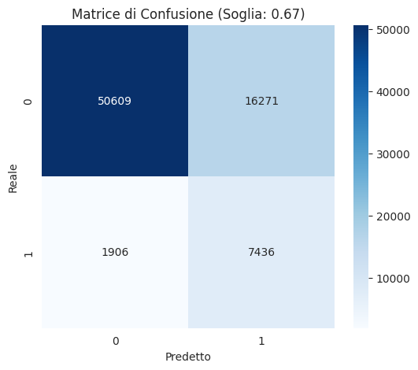

# 🚗 Insurance Cross-Selling Prediction

[](https://www.python.org/downloads/)
[](https://scikit-learn.org/)
[](LICENSE)

A production-ready machine learning pipeline for predicting vehicle insurance cross-selling opportunities for existing customers.

## 📋 Table of Contents

- [Project Overview](#project-overview)
- [Business Value](#business-value)
- [Dataset](#dataset)
- [Methodology](#methodology)
- [Installation](#installation)
- [Usage](#usage)
- [Model Performance](#model-performance)
- [Project Structure](#project-structure)
- [Contributing](#contributing)
- [License](#license)

## 🎯 Project Overview

This project develops a predictive model to identify potential cross-selling opportunities by determining which existing car insurance customers are likely to purchase more vehicle insurance policies.

### Key Objectives

- Predict customer interest in vehicle insurance based on existing customer data
- Improve cross-selling conversion rates through targeted marketing
- Optimize marketing campaign costs with precise customer targeting
- Increase market penetration for vehicle insurance products

## 💼 Business Value

This machine learning solution delivers tangible business outcomes:

| Benefit | Impact |
|---------|--------|
| **Conversion Rate** | Increase sales conversion for vehicle insurance policies |
| **Marketing Efficiency** | Optimize campaigns by targeting high-propensity customers |
| **Cost Reduction** | Reduce marketing spend waste through precise targeting |
| **Customer Satisfaction** | Deliver more relevant, personalized offers |

## 📊 Dataset

The model is trained on customer behavioral and demographic data from AssurePredict.

### Features

| Feature | Description | Type |
|---------|-------------|------|
| `id` | Unique customer identifier | Integer |
| `Gender` | Customer gender | Categorical |
| `Age` | Customer age | Numeric |
| `Driving_License` | 1 if customer has driving license, 0 otherwise | Binary |
| `Region_Code` | Unique code for customer's region | Categorical |
| `Previously_Insured` | 1 if customer already has vehicle insurance, 0 otherwise | Binary |
| `Vehicle_Age` | Age of customer's vehicle | Categorical |
| `Vehicle_Damage` | 1 if customer has had vehicle damage/accident, 0 otherwise | Binary |
| `Annual_Premium` | Annual premium amount paid by customer (€) | Numeric |
| `Policy_Sales_Channel` | Channel used for policy sale (email, phone, in-person) | Categorical |
| `Vintage` | Number of days customer has been insured with AssurePredict | Numeric |
| **`Response`** | **1 if customer accepted cross-sell offer, 0 otherwise (TARGET)** | **Binary** |

## 🔬 Methodology

### Pipeline Architecture

```
Data Loading → Skewness Analysis → Feature Engineering → Train/Test Split
     ↓
Target Encoding → Feature Scaling → Model Training → Threshold Optimization
     ↓
Model Evaluation → Performance Metrics → Production Deployment
```

### Key Techniques

#### 1. **Skewness Correction**
- Analyzed distribution of `Annual_Premium` (highly right-skewed)
- Applied log transformation (`log1p`) to normalize distribution
- Improved model performance with Gaussian-like feature distribution

#### 2. **Advanced Feature Engineering**
- **One-Hot Encoding**: Low-cardinality categorical variables (`Gender`, `Vehicle_Age`, `Vehicle_Damage`)
- **Target Encoding**: High-cardinality variables (`Region_Code`, `Policy_Sales_Channel`)
- **Interaction Features**: Created `Age × Vehicle_Damage` to capture non-linear relationships

#### 3. **Class Imbalance Handling**
- Applied `class_weight='balanced'` in Logistic Regression
- Prevents model bias toward majority class
- Improves recall for positive class (cross-sell acceptance)

#### 4. **Threshold Optimization**
- Default classification threshold (0.5) often suboptimal for imbalanced datasets
- Optimized threshold by maximizing F1 Score on validation set
- Balances precision and recall for business requirements

#### 5. **Data Leakage Prevention**
- **Critical**: Target encoding and scaling performed AFTER train-test split
- Encoding statistics learned only on training data
- Test set treated as truly unseen data

### Model Architecture

**Algorithm**: Logistic Regression with L2 Regularization

**Hyperparameters**:
- `C=1.0` (regularization strength)
- `solver='saga'` (supports L1/L2 penalties)
- `class_weight='balanced'` (handles imbalanced classes)
- `max_iter=5000` (convergence guarantee)

**Rationale**: Logistic Regression chosen for:
- Interpretability (coefficients represent feature importance)
- Computational efficiency
- Probabilistic output (enables threshold tuning)
- Strong baseline performance on tabular data

## 🚀 Installation

### Prerequisites

- Python 3.8 or higher
- pip package manager

### Setup

1. **Clone the repository**
```bash
git clone https://github.com/perofficial_/cross_selling_insurance.git
cd cross_selling_insurance
```

2. **Create virtual environment** (recommended)
```bash
python -m venv venv
source venv/bin/activate  # On Windows: venv\Scripts\activate
```

3. **Install dependencies**
```bash
pip install -r requirements.txt
```

### Required Packages

```
pandas>=1.3.0
numpy>=1.21.0
matplotlib>=3.4.0
seaborn>=0.11.0
scikit-learn>=1.0.0
scipy>=1.7.0
```

Create a `requirements.txt` file with the above contents.

## 💻 Usage

### Basic Execution

Run the complete pipeline:

```bash
python insurance_cross_sell_model.py
```

### Pipeline Output

The script will:
1. Load and clean the dataset
2. Visualize skewness analysis and transformations
3. Engineer features and split data
4. Train the logistic regression model
5. Optimize classification threshold
6. Display evaluation metrics and confusion matrix

### Example Output

```
================================================================================
INSURANCE CROSS-SELLING PREDICTION MODEL
AssurePredict - Production Pipeline
================================================================================

Dataset loaded: 381109 rows, 11 columns

Skewness - Original: 4.8726 -> Transformed: 0.2341
Decision: Applying log transformation

✓ Interaction feature 'Age_x_Damage' created
Total features after engineering: 13

Training set: 304887 samples
Test set: 76222 samples

Optimal Threshold: 0.6664
Best F1 Score: 0.4500

Classification Report:
              precision    recall  f1-score   support

           0       0.96      0.76      0.85     66880
           1       0.31      0.80      0.45      9342

    accuracy                           0.76     76222
   macro avg       0.64      0.78      0.65     76222
weighted avg       0.88      0.76      0.80     76222

ROC-AUC Score: 0.8464
Positive Predictions (Cross-Sell Yes): 23707
Prediction Rate: 31.10%
```


### Custom Configuration

Modify configuration variables at the top of the script:

```python
RANDOM_SEED = 42          # Reproducibility seed
TEST_SIZE = 0.2           # Test set proportion
DATASET_URL = "..."       # Dataset location
```

## 📈 Model Performance

### Evaluation Metrics

| Metric | Value | Description |
|--------|-------|-------------|
| **ROC-AUC** | 0.8464 | Overall discrimination ability |
| **F1 Score (Class 1)** | 0.45 | Balance of precision and recall |
| **Precision (Class 1)** | 0.31 | Accuracy of positive predictions |
| **Recall (Class 1)** | 0.80 | Coverage of actual positives |
| **Accuracy** | 0.76 | Overall correct predictions |
| **Optimal Threshold** | 0.6664 | Custom decision boundary (vs default 0.5) |
| **Prediction Rate** | 31.10% | Share of customers flagged for cross-sell |

### Performance Insights

- **Strong ROC-AUC (0.8464)**: The model has solid discriminative power, correctly ranking positive customers above negative ones 84.6% of the time.
- **High Recall (0.80)**: The model identifies 80% of customers genuinely interested in cross-selling — the priority metric in this business context, where missing an opportunity is more costly than a false positive.
- **Moderate Precision (0.31)**: 1 in 3 flagged customers converts, which is acceptable given the low marginal cost of outreach campaigns.
- **Threshold Tuning (0.6664)**: Raising the threshold above the default 0.5 significantly boosted recall, shifting the model toward a high-coverage strategy suited for broad marketing campaigns.
- **Class Imbalance Handled**: Despite the imbalanced dataset (~12% positive class), the model achieves balanced performance through `class_weight='balanced'` and threshold optimization.

### Confusion matrix


### Business Impact

Out of 76,222 test customers:
- **23,707 flagged** for cross-sell outreach (31.1% of the base)
- **80% recall** means only 1 in 5 genuinely interested customers is missed
- **High coverage strategy**: prioritizes capturing opportunities over precision, ideal for low-cost email/phone campaigns where broad reach maximizes ROI

## 📁 Project Structure

```
cross_selling_insurance/
│
├── insurance_cross_sell_model.py    # Main pipeline script
├── README.md                         # Project documentation
├── requirements.txt                  # Python dependencies
│
├── confusion_matrix.png
│
├── result/
     ├── threshold_optimization.png
│    └── confusion_matrix.png
└── data/                         # Saved outputs (optional)
     └── insurance_cross_sell.csv
```

## 🛠️ Development Roadmap

### Future Enhancements

- [ ] Implement ensemble methods (Random Forest, XGBoost)
- [ ] Add SHAP values for feature importance analysis
- [ ] Create FastAPI endpoint for model deployment
- [ ] Build Streamlit dashboard for interactive predictions
- [ ] Implement MLOps pipeline (MLflow tracking)
- [ ] Add A/B testing framework for threshold validation
- [ ] Develop automated retraining pipeline

## 🤝 Contributing

Contributions are welcome! Please follow these steps:

1. Fork the repository
2. Create a feature branch (`git checkout -b feature/AmazingFeature`)
3. Commit your changes (`git commit -m 'Add some AmazingFeature'`)
4. Push to the branch (`git push origin feature/AmazingFeature`)
5. Open a Pull Request

### Code Standards

- Follow PEP 8 style guide
- Add docstrings to all functions
- Include unit tests for new features
- Update documentation as needed

## 📄 License

This project is licensed under the MIT License - see the [LICENSE](LICENSE) file for details.

## 👥 Authors

**Data Scientist** - Matteo Peroni

## 🙏 Acknowledgments

- AssurePredict for providing the business problem and dataset
- scikit-learn team for excellent ML library
- Open source community for inspiration and tools

## 📞 Contact & Support

For questions or support:
- **Email**: matteoperoni.work@gmail.com

---
